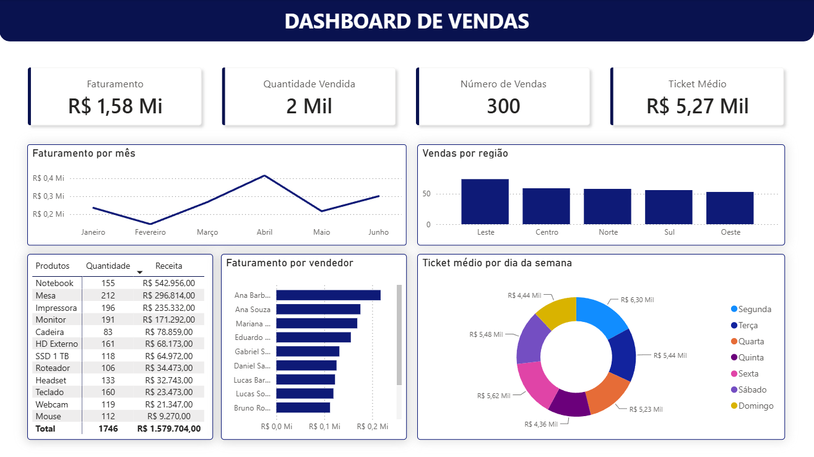

# Sales Analysis Dashboard



Projeto de análise de vendas desenvolvido com **Python, PostgreSQL e Power BI**, demonstrando um pipeline completo de ETL, armazenamento em banco de dados e criação de dashboards para análise de indicadores de negócio.

---

# Objetivo

Construir um pipeline completo de análise de vendas, desde a ingestão dos dados até a criação de um dashboard interativo para apoiar a tomada de decisões.

---

# Fluxo do projeto

```
CSV
   ↓
Python (ETL com Pandas)
   ↓
PostgreSQL
   ↓
Power BI Dashboard
```

---

# Tecnologias utilizadas

- Python
- Pandas
- SQL
- SQLAlchemy
- PostgreSQL
- Power BI

---

# Estrutura do projeto

```
sales-analysis-dashboard/
│
├── data/
│   ├── input/
│   │   └── sales_data.csv
│   └── output/
│
├── src/
│   ├── etl.py
│   ├── load_data.py
│   └── sql/
│       ├── create_table.sql
│       └── query.sql
│
├── screenshots/
│   └── dashboard.png
│
├── sales_dashboard.pbix
├── requirements.txt
├── README.md
└── .gitignore
```

---

# Pipeline

## 1. Ingestão dos dados

Os dados são importados de um arquivo CSV utilizando Python e preparados para armazenamento em banco de dados.

---

## 2. ETL (Extract, Transform and Load)

Durante a transformação dos dados são realizadas operações como:

- Conversão de datas
- Criação das colunas de mês
- Criação das colunas de dia da semana
- Tradução de meses e dias para português
- Cálculo do faturamento (Revenue)
- Padronização dos dados
- Validação dos dados antes do carregamento

Após o tratamento, os dados são carregados para o PostgreSQL.

---

## 3. Dashboard

O Power BI consome os dados tratados do PostgreSQL para construção do dashboard interativo.

### KPIs

- Receita Total
- Quantidade Vendida
- Número de Vendas
- Ticket Médio

### Visualizações

- Receita por mês
- Receita por vendedor
- Receita por região
- Ticket médio por dia da semana
- Produtos vendidos

---

# Dashboard


O dashboard permite analisar o desempenho das vendas por período, vendedor, região e produto, facilitando a identificação de tendências e apoiando a tomada de decisões.

---

# Como executar

## Pré-requisitos

- Python 3.10+
- PostgreSQL
- Power BI Desktop

## Instalação

Clone o repositório:

```bash
git clone https://github.com/themouron/sales-analysis-dashboard.git
```

Instale as dependências:

```bash
pip install -r requirements.txt
```

Configure o PostgreSQL:

- Crie um banco chamado `sales_analysis`.
- Execute o script `create_table.sql`.
- Atualize a senha do PostgreSQL no arquivo de conexão (`etl.py`).

Execute o carregamento dos dados:

```bash
python src/load_data.py
```

Execute o processo de ETL:

```bash
python src/etl.py
```

Por fim, abra o arquivo:

```
sales_dashboard.pbix
```

no Power BI Desktop.

---

# Observações

Este projeto foi desenvolvido para fins de estudo e demonstração de um pipeline completo de análise de dados utilizando Python, PostgreSQL e Power BI.

---

# Autor

**Daniel Mourão**

Graduando em Matemática (Bacharelado) pela UFRRJ.

GitHub: https://github.com/themouron